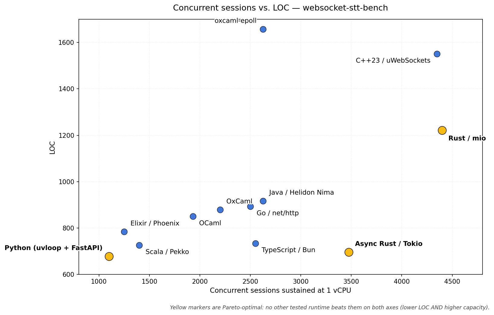
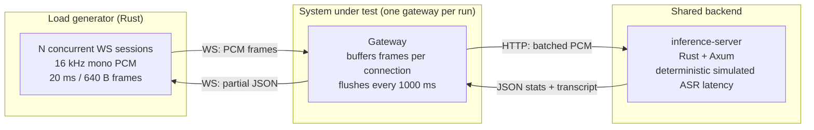

# websocket-stt-bench

## How many concurrent websocket audio-streaming sessions can modern async/actor runtimes sustain per vCPU?

This repo benchmarks streaming STT gateways behind one shared WebSocket protocol. Clients stream 16 kHz mono PCM at 20 ms / 640-byte frames; each gateway buffers per session, flushes every 1000 ms to a shared Rust inference simulator, and returns strict `partial` JSON messages.

I also heavily used coding agents, with a benchmark harness to assess correctness and reproducability on k8s.

I bench:
- C++23 - uWebSockets/uSockets on Linux epoll
- Python 3.14.4 and 3.14.4t - FastAPI, uvloop, Granian
- Elixir 1.19.5 - Phoenix + Bandit on BEAM, raw WebSock
- Rust 1.95 - async Axum/Tokio
- TypeScript - Bun 1.3.13, Bun.serve WebSockets
- Go 1.26.3 - net/http and coder/websocket
- Java 25 LTS - Helidon Níma with virtual threads
- Scala 3.3 LTS - Pekko actors on the JVM
- OCaml - both [OxCaml 5.2.0+ox](https://oxcaml.org/) and OCaml 5.4.1 + Async

Inspired by the [Benchmarks Game](https://benchmarksgame-team.pages.debian.net/benchmarksgame/index.html) and Karpathy's [autoresearch](https://github.com/karpathy/autoresearch).

## TL;DR



*Concurrent WebSocket sessions sustained inside the [SLO](#the-slo-what-passing-means):*

| Runtime | 1 vCPU | 2 vCPU | Bottleneck | LOC | Details |
|---|---:|---:|---|---:|---|
| **[C++23](https://en.cppreference.com/w/cpp/23) + [uWebSockets 20.77](https://github.com/uNetworking/uWebSockets)** | **4450** | **TBD** | CPU/latency | 1.6k | [runs](services/cpp23-uwebsockets/BENCHMARK.md) |
| **[Rust 1.95](https://github.com/rust-lang/rust) + async [Axum](https://github.com/tokio-rs/axum) / [Tokio](https://github.com/tokio-rs/tokio)** | **3475** | **4250** (1.22X) | CPU | 696 | [runs](services/rust-axum/BENCHMARK.md) |
| **[Java 25 LTS](https://openjdk.org/projects/jdk/25/) + [Helidon Níma 4.3](https://helidon.io/)** | 2625‡ | 3750 (1.43X) | latency, then heap/OOM cliff | 917 | [runs](services/java-helidon-nima/BENCHMARK.md) |
| **[TypeScript](https://www.typescriptlang.org/) on [Bun 1.3.13](https://bun.sh/)** | 2550‡ | n/a | memory/error cliff; fetch caveat | 734 | [runs](services/typescript-bun/BENCHMARK.md) |
| **[Go 1.26.3](https://go.dev/) + `net/http` / [`coder/websocket`](https://github.com/coder/websocket)** | 2500‡ | 4000 (1.60X) | CPU/latency | 893 | [runs](services/go-nethttp/BENCHMARK.md) |
| **[OxCaml 5.2.0+ox](https://oxcaml.org/) + Async** | 2075 | 3350§ (replicas) | CPU, single Async domain | 1235 | [runs](services/ocaml-oxcaml/BENCHMARK.md) |
| **OCaml 5.4.1 + Async** | 1930 | TBD | CPU, single Async domain | 1236 | [runs](services/ocaml-websocket-async/BENCHMARK.md) |
| **[Scala 3.3 LTS](https://www.scala-lang.org/) + [Apache Pekko 1.6](https://pekko.apache.org/)** | 1400 | 2200 (1.57X) | connect timeouts | 726 | [runs](services/scala-pekko/BENCHMARK.md) |
| **[Elixir 1.19.5](https://github.com/elixir-lang/elixir) + [Phoenix](https://github.com/phoenixframework/phoenix) / [Bandit](https://github.com/mtrudel/bandit)** | 1250 | 2250 (1.80X) | CPU/memory | 784 | [runs](services/elixir-phoenix/BENCHMARK.md) |
| **[CPython 3.14.4](https://github.com/python/cpython) + uvloop + FastAPI / Granian** | 1100 | 1750 (1.59X)† | CPU | 678 | [runs](services/python-fastapi/BENCHMARK.md) |
| **[CPython 3.14.4t](https://github.com/python/cpython) free-threaded + uvloop + FastAPI / Granian** | 180 | 205 (1.14X) | send/close timeout reliability | 678 | [runs](services/python-fastapi/BENCHMARK.md) |

† Python scales out at 2 vCPU by adding worker processes; each Granian worker owns one asyncio loop.
‡ 1 vCPU / 2 GiB memory. The 1 GiB shape also OOMs near the edge, so the bumped 2 GiB shape is reported.
§ OxCaml runs one Async domain; a 2-vCPU pod does not use the second core meaningfully. Replica fan-out reached 3350 / 1.61X.

The above numbers are the highest confirmed session counts that passed the SLO at the given vCPU shape. Detailed brackets, tables, and run notes live in the linked service benchmark docs.

**Hardware:** Intel Core i9-13900F, Ubuntu 24.04.3, k3s v1.35.4.

## Takeaways

- No surpise that C++ leads per vCPU; async Rust is a distant second, which I am surprised by the gap. The GC'ed languages then follow with Java, TS, and Go are still the broad high-throughput tier
- Async Rust is likely the best balance here: 696 LOC and 3475 sessions/vCPU. Both Claude Opus 4.6 (max) and GPT 4.5 (xhigh) had no issue writing Rust.
- Tail-latency SLOs expose GC jitter. Passing requires p95 frame latency, not just average throughput, so allocation pressure, safepoints, and collection pauses can turn otherwise healthy throughput into latency cliffs. The size of that penalty is stack- and tuning-dependent, not a blanket verdict on every GC runtime.
- Two managed-runtime clusters show up. Java, Bun, and Go form the fast GC/managed tier around 2500-2625 sessions/vCPU, with Java narrowly ahead. Actor-style runtimes cluster lower at 1 vCPU: Elixir/BEAM at 1250 and Scala/Pekko at 1400, though both land near 2200-2250 at 2 vCPU; Scala still has a connect-timeout caveat.
- BEAM scales vertically really well but dissapoints overall: Elixir trails at 1 vCPU but has the cleanest 1→2 vCPU lift. Similar story with Scala + actor framework. Perhaps this is a actor concurency model issue overall? TODO: investigate this.
- Bun is surprisingly competitive for a native WebSocket server path. It simply has no right beating Go and coming incredibly close to Java. Great job Bun! 👏
- OxCaml got close-ish to Java only after raw transport work: persistent keep-alive + zero-copy framing moved the confirmed ceiling from 1050 to 2075. Jane Street looks to have made some noticeable improvements over OCaml with their fork. There are downsides as I couldn't use the standard async ocaml websockets framework with their fork, alas Claude had no problem writing a simple one from scratch. For a GC'ed non JVM language the perf seems impressive enough to me, it also reads extremely elegantly, only Elixir comes close.
- The stock OCaml gap was mostly transport: replacing `cohttp-async` + `websocket-async` with the same raw Async TCP shape moved stock OCaml to 1930, within about 7% of OxCaml's confirmed 2075.
- Free-threaded Python with this FastAPI/Granian stack has issues; TODO: investigate this.
- Some languages/runtimes were easier to prompt for than others. Rust and Python took me one or two prompts. C++ needed me to take over and repeatedly steer towards C++ concepts I have long forgotten (RAII, move semantics, etc); OxCaml was easy but building was downright painful (30m or so to build, OxCaml desperately needs better tooling like pre-built docker images).

**Pareto frontier:** Python (678 LOC / 1100 sessions, leanest) · Async Rust/Axum (696 LOC / 3475, best balance) · C++23 (1551 LOC / 4450, most capacity).

## The SLO: what "passing" means

"Passing" means every gate below holds against loadgen HDR histograms, per audio frame:

| Gate | Threshold | What it bounds |
|---|---:|---|
| **Newest-frame p50** | **≤ 200 ms** | Responsiveness to freshest audio in a flushed batch |
| Newest-frame p95 | ≤ 350 ms | Tail on fresh audio |
| **Oldest-frame p50** | **≤ 1200 ms** | Worst per-frame wait after the 1000 ms flush interval |
| Oldest-frame p95 | ≤ 1650 ms | Tail on oldest buffered audio |
| **Errors** | **≤ 1 / 100k partials** | Protocol errors, inference failures, and timeouts |

The error budget tolerates kernel/TCP stall noise while staying far tighter than typical production STT targets.

## What this experiment measures

The gateways share the same black-box WebSocket contract:

- `GET /ws/stt` upgrades to WebSocket; `GET /health` returns 200.
- Client sends `{"type":"start"}` as text, then 640-byte binary PCM frames at 50 fps.
- Gateway flushes every 1000 ms to a shared Rust inference simulator.
- Gateway holds at most one in-flight inference request per connection.
- Gateway returns strict `partial` JSON with `oldest_frame_seq`, `newest_frame_seq`, `flush_lateness_ms`, and `inflight_model_jobs`.
- Invalid first message closes with `1002`; invalid binary frame size closes with `1003`.

The shared inference server is deterministic and simulates GPU-style latency with log-normal jitter, batch wait, and long-tail spikes. It is not a real ASR model. Real ASR weights, authentication, multi-tenancy, segmentation, retry/reconnect logic, and VAD are intentionally out of scope.

## Architecture



## Code Shape

| Runtime | Raw production LOC | Files | Implementation shape |
|---|---:|---:|---|
| Python | 678 | 9 | Pydantic boundaries, uvloop/FastAPI, dual GIL/free-threaded runtime path |
| Async Rust/Axum | 696 | 6 | Tokio tasks, `Arc<Semaphore>::new(1)`, zero-copy `BytesMut` batching |
| TypeScript/Bun | 734 | 6 | `Bun.serve`, Valibot boundaries, bounded outbox |
| Elixir | 784 | 13 | Phoenix/Bandit raw `WebSock`, process-per-connection |
| Go | 893 | 6 | `net/http`, `coder/websocket`, h2c inference client |
| Java | 917 | 16 | Helidon Níma virtual threads, sealed outbound messages |
| Stock OCaml/Async | 1236 | 25 | raw `Async.Tcp`, hand-rolled RFC 6455, structural one-inflight flush loop |
| OxCaml | 1235 | 21 | raw `Async.Tcp`, hand-rolled RFC 6455, opaque inflight capability |
| C++23 | 1551 | 11 | uWebSockets loop-per-thread, libcurl HTTP/2, Glaze JSON |

The load-bearing invariant is one in-flight inference request per connection. Every implementation enforces it, but the expression differs: semaphore, atomic flag, token channel, process state, task guard, sequential flush loop, or `Mvar`-backed capability.

## Which runtime?

| If you optimize for | Pick | Why |
|---|---|---|
| Lowest dollars per session | C++23/uWebSockets | 4450 sessions/vCPU |
| Lowest dollars with memory safety | Async Rust/Axum | 3475 sessions/vCPU with compact code |
| Rust-adjacent JVM capacity | Java/Helidon Níma | 2625 sessions/vCPU; watch heap at the cliff |
| JS ecosystem with strong capacity | TypeScript on Bun | 2550 sessions/vCPU on native Bun primitives |
| Go operational simplicity | Go/net-http | 2500 sessions/vCPU and explicit h2c transport |
| Vertical multi-core scale-up | Elixir | 1.80X lift 1→2 vCPU |
| Modeling invariants as types | OxCaml | opaque inflight capability, still runtime-enforced |
| Upstream OCaml without OxCaml | Stock OCaml/Async raw transport | within about 7% of OxCaml once transport is held roughly constant |
| Free-threaded Python | wait | this stack is reliability-limited |

## Reproducing

```sh
just doctor          # verify pinned tool versions
just check           # full per-language gate
just compose-build   # build all images
just conformance     # protocol contract check
just bench-ladder rust-axum-single ws://127.0.0.1:3000/ws/stt
```

Local Compose runs the `single` or `multi` profile one at a time because profiles share host ports. Multi-vCPU capacity claims should be verified in-cluster; Compose under-reports once the gateway outpaces the in-VM inference simulator.

For reproducible Kubernetes runs, use `charts/stt-bench/` and `charts/stt-bench/README.md`. The chart renders the inference server, gateway Deployments, suspended loadgen/inferbench Jobs, and results PVC. Analysis uses paired `*.summary.json` / `*.samples.csv` artifacts:

```sh
just analyze-results <input-dir> <output-dir>
```

## Environment

- **Load generator:** `loadgen/rust/`, `tokio-tungstenite`, HDR histograms, strict `partial` validation.
- **k3s node:** Intel Core i9-13900F, 32 logical CPUs, 64 GiB RAM, Ubuntu 24.04.3, k3s v1.35.4.
- **Scheduling caveat:** Kubernetes CPU requests/limits are CFS quota, not CPU affinity; edge points can move with P/E-core migration on this hybrid CPU. Repeats and raw sample CSVs are the evidence.
- **Pinned versions:** `versions.lock.toml`.

## Known gaps

The current setup models compute saturation but not every backpressure path. Open: bounded per-connection input buffers with overflow policy, client-side send-wait time as a KPI, per-connection queue/drop metrics, a cross-connection job-queue limit, and overload conformance/stress checks.

**Inference-server placement:** local Compose under-reports fast gateway capacity once the gateway can outpace the in-VM simulator. Use the in-cluster path for capacity claims.

## Disclosure

This repo was created with assistance from ChatGPT 5.5 and Claude Opus 4.7.
