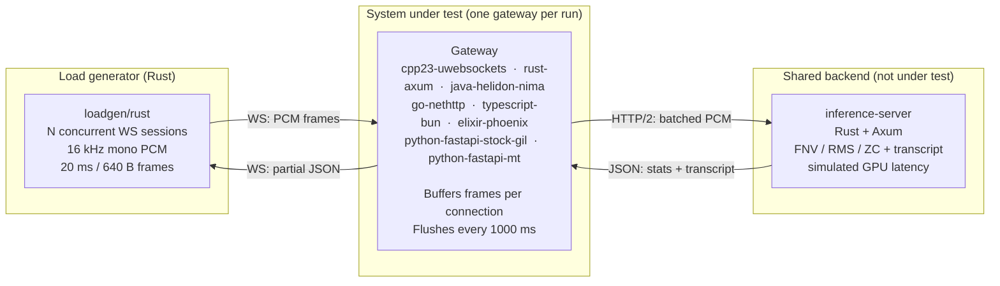

# websocket-stt-bench

## How many concurrent websocket audio-streaming sessions can modern async/actor runtimes sustain per vCPU?

We bench:
- C++23
- Python 3.14.4
- Elixir 1.19.5
- Rust 1.95
- TypeScript on Bun 1.3.13
- Go 1.26.3
- Java 25 LTS (Helidon Níma virtual threads)
- Scala 3.3 LTS (Pekko actors on the JVM)
- OCaml on Jane Street's [OxCaml 5.2.0+ox](https://oxcaml.org/) — 2075 sessions/vCPU (Go/Bun tier; up from 1050 after removing the per-flush inference connect and the per-frame copies — see [How the code turned out](#how-the-code-turned-out)). The inflight invariant is modeled as an opaque, mint-once capability type rather than a raw boolean (runtime-enforced by an `Mvar`; an honest attempt at `@ unique` compile-time enforcement hit Async's un-mode-annotated APIs).
- Stock OCaml 5.4.1 on the normal Async ecosystem stack (`cohttp-async` + `websocket-async`) — 1212 sessions/vCPU. This is the practical upstream-OCaml/library baseline; it is not a compiler-only A/B against OxCaml because the transport stack is different too.

This benchmark tries to emulate a realistic-ish, near-realtime, speech-to-text "streaming" workload, including the protocol.

See [below](#what-this-experiment-measures) for the exact benchmark setup, including assumptions and SLOs.

Inspired by the [Benchmarks Game](https://benchmarksgame-team.pages.debian.net/benchmarksgame/index.html) and by Karpathy's [autoresearch](https://github.com/karpathy/autoresearch).

## TL;DR


*Concurrent WebSocket sessions* sustained inside the [SLO](#the-slo-what-passing-means):

| Runtime | LOC | 1 vCPU | 2 vCPU | Bottleneck |
|---|---:|---:|---:|---|
| **[C++23](https://en.cppreference.com/w/cpp/23) + [uWebSockets 20.77](https://github.com/uNetworking/uWebSockets)** (loop-per-thread, no GC) | 1.6k | **4450** | **TBD** | CPU/latency |
| **[Rust 1.95](https://github.com/rust-lang/rust) + [Axum](https://github.com/tokio-rs/axum) / [Tokio](https://github.com/tokio-rs/tokio)** | 696 | **3475** | **4250** (1.22X) | CPU |
| **[Java 25 LTS](https://openjdk.org/projects/jdk/25/) + [Helidon Níma 4.3](https://helidon.io/) (vthreads, JEP 491)** | 917 | 2600‡ | 3750 (1.44X) | latency, then heap/OOM cliff |
| **[TypeScript](https://www.typescriptlang.org/) on [Bun 1.3.13](https://bun.sh/)** | 734 | 2550‡ | n/a | memory/error cliff; fetch caveat |
| **[Go 1.26.3](https://go.dev/) + `net/http` / [`coder/websocket`](https://github.com/coder/websocket)** | 893 | 2500‡ | 4000 (1.60X) | CPU/latency |
| **[OxCaml 5.2.0+ox](https://oxcaml.org/) (Async, single-domain; hand-rolled RFC 6455 + raw HTTP/1.1 keep-alive)** | 1235 | 2075 | 3350§ (replicas) | CPU (single Async domain) |
| **[Scala 3.3 LTS](https://www.scala-lang.org/) + [Apache Pekko 1.6](https://pekko.apache.org/) (actor model, JVM)** | 726 | 1400 | 2200 (1.57X) | connect timeouts, TODO: investigate this, surprising. |
| **[Elixir 1.19.5](https://github.com/elixir-lang/elixir) + [Phoenix](https://github.com/phoenixframework/phoenix) / [Bandit](https://github.com/mtrudel/bandit)** | 784 | 1250 | 2250 (1.80X) | CPU |
| **OCaml 5.4.1 + Async / `cohttp-async` / `websocket-async`** | 882 | 1212 | 2225¶ (replicas) | CPU (library stack + single Async domain) |
| **[CPython 3.14.4](https://github.com/python/cpython) ([uvloop](https://github.com/MagicStack/uvloop) + [FastAPI](https://github.com/fastapi/fastapi), [granian](https://github.com/emmett-framework/granian))** | 678 | 1100 | 1750 (1.59X)† | CPU |
| **[CPython 3.14.4t](https://github.com/python/cpython) (GIL-free, [uvloop](https://github.com/MagicStack/uvloop) + [FastAPI](https://github.com/fastapi/fastapi), [granian](https://github.com/emmett-framework/granian)) (`mt`)** | 678 | 180 | 205 (1.14X) | send/close timeout reliability? (TODO: investigate) |


† Python (uvloop + FastAPI) scales out at 2 vCPU by adding worker processes (one asyncio loop per Granian worker). Every other runtime here uses in-process multi-threading on the second core.

‡ 1 vCPU / 2 GiB memory. The 1 GiB shape also OOMs near the edge, so the bumped 2 GiB shape is the reported bracket.

§ OxCaml runs a single Async domain. Measured both ways (2026-05-16): a 2-vCPU pod ≈ 1-vCPU (~2125, second core idle); two 1-vCPU replicas bracket **3350 / 1.61X, zero errors** — replica fan-out is the only real 2-vCPU lever. `janestreet/parallel` can't change this — its `parallel` needs an `@ once portable` closure and Async sockets are domain-pinned, so an I/O session provably can't cross domains. Detail in the [sweep section](#detailed-sweep-points).

¶ Stock OCaml uses upstream OCaml 5.4.1 and the normal Async library path. Measured both ways (2026-05-16): a 2-vCPU pod only reached **1250** (the single Async domain stays the wall); two 1-vCPU replicas reached **2225 / 1.84X, zero errors**. This is a practical ecosystem-stack comparison, not a pure OxCaml compiler delta.

The above numbers are the highest concurrent sessions that passed the SLO at n vCPU. Example: C++ 1-vCPU ceiling is bracketed between 4450 (passes) and 4475 (first fail).

**Hardware:**
CPU: Intel Core i9-13900F, OS / cluster: Ubuntu 24.04.3, k3s v1.35.4

_Note: this is a i/o bound workload. Every 1000 ms flush triggers fake CPU work in a shared inference simulator._

### Not Surprising

- **C++ takes the per-vCPU lead, but Rust, Java, Bun, and Go are still in the same broad tier.** C++ sustains 4450 sessions at 1 vCPU; Rust @ 3475, Java @ 2600, Bun @ 2550, and Go @ 2500.

- **BEAM shines as soon as you add more cores.** Elixir's 1.80× lift from 1→2 vCPU is the cleanest vertical result on the page — Rust is 1.22×. Open question: does the slope hold at 4 vCPU, where BEAM should keep going while Rust's per-core efficiency continues to erode? Worth running.

### Surprising

- **Bun-native TypeScript is still surprisingly close to the Rust/JVM/Go tier.** This uses Bun's built-in `Bun.serve()` WebSocket server and Bun `fetch`, not a framework. That is a fair Bun runtime measurement, but not a transport-parity measurement against Rust's explicit h2c `reqwest` client (h2c = HTTP/2 cleartext — HTTP/2 over plain TCP, no TLS).

- **Either Elixir disappoints per vCPU, and/or Python punches way above its weight.** At 1 vCPU Elixir leads CPython 3.14 (uvloop + FastAPI) by only 14% and trails Bun by ~2×. Single-loop async on a fast event loop is a stronger baseline than the BEAM-vs-Python folklore suggests, and the BEAM advantage doesn't really show up until you scale up the pod. Honestly, I have been just absolutely dissapointed by Elixir and the legendary Erlang VM. I am hoping that there is something wrong with the code here as this is just not acceptable to be within 15% of Python!

- **Rust isn't more verbose than its managed-runtime peers.** Raw production LOC: Python 678, Rust 696, TypeScript/Bun 734, Elixir 784, stock OCaml 882, Go 893, Java 917, OCaml/OxCaml 1235, C++ 1551. C++ is the outlier on size; the rest stay in the same band. The "Rust = verbose" intuition doesn't survive a one-protocol head-to-head; details in "How the code turned out" below.

- **A hand-rolled OCaml stack lands surprisingly close to Java.** Java is the top GC'd runtime here (2600). OxCaml reaches **2075 (≈0.8× Java)** — and it does so with *no mature WebSocket library*: raw `Async.Tcp`, a hand-written RFC 6455 framer + SHA-1 + base64, a single event domain, where Java/Bun/Go all lean on mature optimized stacks. That a from-scratch transport gets within 20% of Helidon Níma is the surprise. The ceiling was transport plumbing: the first build hit 1050 (a fresh TCP connect to inference on *every* flush saturated the one Async domain on connection churn, zero errors to the cliff); a persistent keep-alive connection + a zero-copy frame path moved the confirmed ceiling **1050 → 1750 → 2075**, and a later JSON micro-opt plus a full cleanup round were both *measured no-ops* on the wall — the residual limit is raw single-Async-domain CPU. The new stock-OCaml library-stack baseline lands at **1212**, so OxCaml + the hand-rolled transport is **1.71X** faster at 1 vCPU, but this is not a pure compiler comparison: compiler, version, and transport stack all changed. 2-vCPU is replica-only for both OCaml variants (single domain — see § / ¶ and the [sweep section](#detailed-sweep-points)).

**Pareto-optimal:** Python (678 LOC / 1100 sess, leanest) · Rust (696 LOC / 3475 sess, best balance) · C++23 (1551 LOC / 4450 sess, most capacity). Everyone else is dominated on both axes.

### Takeaways

Sessions per vCPU is the inverse of cloud cost per session, so the TL;DR ranking is also the cost ranking:

| Runtime | vCPUs per session (C++ = 1×) |
|---|---:|
| C++23/uWebSockets | **1.0×** baseline |
| Rust | **1.3×** |
| Java/Helidon Níma | **1.7×** |
| TypeScript/Bun | **1.7×** |
| Go | **1.8×** |
| OxCaml 5.2.0+ox (Async, single-domain) | **2.1×** — keep-alive + zero-copy tuned; single-domain CPU wall |
| Scala/Pekko | **3.2×** |
| Elixir | **3.6×** (narrows at 2 vCPU) |
| Stock OCaml 5.4.1 (Async library stack) | **3.7×** — simpler ecosystem path, lower ceiling |
| CPython 3.14 (uvloop + FastAPI) | **4.0×** |
| CPython 3.14.4t free-threaded `mt` | **25×** — reliability-limited, see [Issues](#issues) |

At equal session counts, Rust costs ~1.3× more vCPUs than C++ in this run; Java, Bun, and Go cost ~1.7-1.8× more; a Python implementation costs 4.0× more. See [Which runtime?](#which-runtime) below for the decision matrix.

### Issues

- **Treat the FastAPI + Granian + CPython 3.14.4t result as "this combo isn't ready", not as a verdict on free-threaded Python.** The 6.1× gap to uvloop + FastAPI is a stack issue, not a no-GIL one. 180 sessions at 1 vCPU is far below what the interpreter should drive on this workload, and the failure mode isn't latency — newest p50 sits at ~99 ms right up to the failing point. The runs fail on send/close timeouts, not on the gateway falling behind audio. Suspect culprits: Granian's `mt` runtime mode on a free-threaded build (Granian's docs caveat that production tuning data is thin), FastAPI/Starlette middleware paying an atomic-refcount tax on every frame, or a WS write-path stall specific to this stack.
- **Bun `fetch` is not an h2c-parity client.** The TypeScript gateway intentionally uses Bun-native primitives: `Bun.serve()` and Bun `fetch`. If the 2600-session cliff is partly transport behavior rather than WebSocket/runtime behavior, the next comparison is a second TypeScript variant with an explicit h2c-capable HTTP client.
- **Java's upper failing points are heap-shaped.** Java/Helidon Níma passes close to the Rust-adjacent band, but 2750 at 1 vCPU and 3900+ at 2 vCPU triggered `OutOfMemoryError: Java heap space` in the Helidon WebSocket read path under the 2 GiB pod limit. The first balanced-SLO failures are latency at 2650 and 3800; the next higher probes become memory/reliability cliffs.

## What this experiment measures

> **tl;dr.** The gateway implementations share one WebSocket protocol — C++23 / uWebSockets, Rust 1.95 / Tokio (Axum), Java 25 / Helidon Níma virtual threads, Go 1.26.3 / `net/http` (`coder/websocket`), TypeScript on Bun 1.3.13 (`Bun.serve` + Bun `fetch`), Elixir 1.19.5 / BEAM (Phoenix + Bandit on raw `WebSock`), Scala 3.3 / Pekko, OCaml in two Async variants (OxCaml + raw transport, stock OCaml + ecosystem WebSocket stack), and CPython 3.14 in two flavors (with GIL, free-threaded `t`) on uvloop + FastAPI / Granian — all behind a shared Rust inference endpoint. Inference is a deterministic Rust simulator with realistic GPU-style latency (log-normal jitter + batch wait + long-tail spikes), not a real ASR model. Tail behavior against a real CUDA-bound ASR may shift absolute numbers; the runtime ranking should not.

Clients emit 16 kHz mono PCM at **20 ms / 640-byte** frames (that's 50 fps per session).

The websocket gateway (aka the server under test) buffers per connection, flushes every **1000 ms** to a shared inference server over HTTP/2 for each client, and holds **at most one inflight inference request per connection** — so back-pressure surfaces as growing per-frame buffer latency, not unbounded task spawning. Each `partial` frame carries `oldest_frame_seq` + `newest_frame_seq`, giving two latency curves: `newest` (fresh-audio responsiveness, mostly inference RTT) and `oldest` (worst per-frame wait, saturates first).

The gateway then relays the inference server's response as a `partial` JSON message back to the client (the load generator), which validates each `partial` against the strict schema and records `(now - sent_time)` for each frame.

This process is typical of a near-realtime speech-to-text workload.

**Not modeled**: real ASR weights, authentication, multi-tenancy, multi-utterance segmentation, retry/reconnect logic. Pinned versions in `versions.lock.toml`.

> **No VAD.** Real STT pipelines size flush boundaries dynamically using voice-activity detection. We hardcode 1000 ms so cross-runtime comparisons aren't contaminated by VAD-implementation noise.

## Architecture



## The SLO (what "passing" means)

"Passing" means **every** gate below holds against the loadgen's HDR histograms (per-frame, send-to-`partial`):

| Gate | Threshold | What it bounds |
|---|---:|---|
| **Newest-frame p50** | **≤ 200 ms** | Responsiveness to the freshest audio in a flushed batch (≈ inference RTT) |
| Newest-frame p95 | ≤ 350 ms | Tail on fresh audio |
| **Oldest-frame p50** | **≤ 1200 ms** | Worst per-frame wait (waited a full 1000 ms flush + RTT) — saturates first |
| Oldest-frame p95 | ≤ 1650 ms | Tail on the oldest frame |
| **Errors** | **≤ 1 / 100k partials** | Protocol errors, inference failures, timeouts (`--max-error-rate 1e-5`) |

Error budget tolerates the kernel/TCP-stall noise floor (~10⁻⁶) while staying 2–3 orders tighter than typical production STT targets (10⁻³–10⁻⁴).

## How the code turned out

| Runtime | Raw production LOC | Files | Notable |
|---|---:|---:|---|
| **Python** | 678 | 9 | Pydantic boundary validation; dual GIL / free-threaded runtime path |
| **Rust** | 696 | 6 | Explicit `Arc<Semaphore>::new(1)` invariant; zero-copy `BytesMut` batching |
| **TypeScript/Bun** | 734 | 6 | Bun-native `Bun.serve()`; Valibot boundary validation; bounded outbox tracks Bun send backpressure |
| **Elixir** | 784 | 13 | Process-per-connection + supervision; per-message protocol modules inflate file count |
| **Stock OCaml/Async** | 882 | 17 | Upstream OCaml 5.4.1; `cohttp-async` + `websocket-async`; structural one-inflight flush loop |
| **Go** | 893 | 6 | `net/http` + `coder/websocket`; h2c inference transport; unit-testable session core |
| **Java** | 917 | 16 | Java 25 instance main; Helidon Níma virtual threads; sealed outbound messages |
| **OCaml/OxCaml** | 1235 | 21 | Inflight invariant is an opaque `Inflight_capability.t` (mint-once → `consume` → re-mint from `Token`), runtime-enforced by an `Async.Mvar`. Raw `Async.Tcp` transport with hand-rolled RFC 6455 framing + SHA-1 + base64 (the `websocket-async`/`cohttp-async` stack pulled in `digestif`, which doesn't compile on the OxCaml 5.2.0+ox switch invariant). `.ml`+`.mli` pairs inflate the file count. |
| **C++23** | 1551 | 11 | uWebSockets loop-per-thread; system libcurl HTTP/2 transport; Glaze JSON |

The managed-runtime implementations plus Rust are in the same size band. C++ buys the highest measured per-vCPU capacity here, but it is also the largest implementation. Sources: `services/cpp23-uwebsockets/src/`, `services/rust-axum/src/`, `services/java-helidon-nima/src/main/java/`, `services/go-nethttp/`, `services/typescript-bun/src/`, `services/elixir-phoenix/lib/`, `services/python-fastapi/app/`, `services/ocaml-websocket-async/`, `services/ocaml-oxcaml/`.

- **C++23 — uWebSockets + libcurl multi, 1551 raw LOC.** Uses uWebSockets' loop-per-thread model, Glaze for strict JSON, a bounded per-session buffer, and system libcurl with nghttp2 for gateway-to-inference HTTP/2. The tuned 1-vCPU result depends on `INFERENCE_HTTP_CLIENTS=128`; the earlier BCR curl build did not provide the needed HTTP/2 behavior and hit a much lower cliff.
- **Rust — Tokio + Axum, 696 raw LOC.** Uses `Arc<Semaphore>::new(1)` for the inflight invariant, `BytesMut` for zero-copy frame batching, and `tokio::select! { biased; }` to drain partials before reading new frames so back-pressure surfaces as oldest-frame latency growth. The borrow checker prevents a frame reference from being held across `.await`, and Serde's `deny_unknown_fields` validates the wire protocol at compile time. Rough edges: `Mutex.lock().expect("...")` panics on poisoning (`session.rs:116`), there are no gateway-local tests, and runtime version constants are manually kept in sync with `Cargo.toml`.
- **Java — Helidon Níma on virtual threads, 917 raw LOC.** Uses Java 25's instance `void main()`, markdown doc comments, virtual-thread receive/write/flush work, a one-slot `AtomicBoolean` inflight guard, sealed outbound messages, Jackson records for strict wire mapping, and a bounded four-slot outbox. JDK 25's virtual-thread pinning work keeps the model credible for I/O-heavy fanout. Rough edge: the Helidon WebSocket read path showed Java heap pressure near the higher failing probes under a 2 GiB pod limit.
- **Go — `net/http` + `coder/websocket`, 893 raw LOC.** Uses the standard server stack, a one-token channel for the inflight invariant, `goccy/go-json` with strict decoding at the WebSocket and inference boundaries, and an explicit h2c inference client built on `golang.org/x/net/http2`. Rough edge: the implementation is a little larger because the session core is split for unit testing instead of hiding protocol behavior inside the HTTP handler.
- **TypeScript/Bun — `Bun.serve()` + Bun `fetch`, 734 raw LOC.** Uses Valibot `strictObject` schemas at the WebSocket and inference boundaries, a private `inflight` promise for the one-batch invariant, and a bounded four-slot outbox that treats Bun `send()` backpressure as occupied capacity instead of handing unbounded strings to the runtime. Rough edge: Bun `fetch` is the honest Bun-native client, but it is not the same explicit h2c transport shape as Rust's `reqwest` path.
- **Elixir — Phoenix 1.8 + Bandit on raw `WebSock`, 784 raw LOC.** Channels would force binary frames through a JSON-base64 wrapper at 50 fps, so the service uses `WebSockAdapter.upgrade/4` directly. Pattern matching at the function head enforces the protocol — text-only for `start`, binary-only after, strict 640-byte frames — turning schema violations into WebSocket close codes 1002/1003 by construction (`stt_web_socket.ex:39-71`). Process-per-connection means one connection's crash doesn't affect others, supervision is real, and the `busy?` inflight flag is scannable in one spot. Rough edge: less observability instrumentation than production needs — no per-connection metrics or buffer-depth histograms.
- **Python — uvloop + FastAPI on Granian, 678 raw LOC.** Boundary safety is Pydantic with `extra="forbid"` plus `ty` static type-checking. The flush loop and writer loop are decoupled into two long-running tasks (`session.py:61-63`), keeping inference time independent of WebSocket send time. Two CPython builds share one codebase via a startup runtime assertion (`runtime.py`): GIL-on with uvloop, and free-threaded `t` with `Py_GIL_DISABLED=1`. Rough edge: the inflight invariant is a runtime walrus-guarded check (`session.py:96`), not a type-enforced primitive — easier to break during refactoring than Rust's semaphore or Elixir's flag.
- **Stock OCaml 5.4.1 — Async + `cohttp-async` + `websocket-async`, 882 raw LOC.** This is the canonical upstream-OCaml ecosystem path we wanted as a comparison: no OxCaml mode system, no custom SHA-1/base64/framer, and a smaller codebase. The trade-off is throughput: **1212** confirmed at 1 vCPU versus **2075** for OxCaml + raw transport. The one-inflight invariant is structural here: the flush loop awaits the inference request before taking the next batch, so there is no separate semaphore/Mvar. `WORKER_THREADS` and `INFERENCE_HTTP_CLIENTS` are accepted for env-contract parity but are no-ops in this single-domain implementation.
- **OCaml/OxCaml — Async + raw `Tcp.Server`/`Tcp.connect` + hand-rolled RFC 6455, 1235 raw LOC.** Jane Street's experimental fork ([oxcaml.org](https://oxcaml.org/)) adds a mode system (`portable`/`sync`/`unique`) to OCaml 5.2. The goal was to make the inflight invariant `Inflight_capability.t @ unique` so a double-fire is a *compile error* — but the capability must cross `Async`'s `Mvar`/`Deferred` boundary and stock Async isn't mode-annotated (`Mvar.take_now` returns `aliased`), so `@ unique` doesn't survive the round-trip. Shipped instead: `Inflight_capability.t` is an opaque mint-once type (`create_for_session` → `consume` → `Token.t` → `of_token`); the discipline is explicit in the API shape but the runtime guarantee is still the per-session `Async.Mvar`. Honest read: same *category* as the other gateways' runtime guards, expressed through the type system rather than a flag — not the stronger compile-time proof. Rough edges: (1) the transport is hand-rolled — `websocket-async`/`cohttp-async` pull `digestif`, which doesn't compile on OxCaml 5.2.0+ox, so the gateway carries its own RFC 6455 framer + SHA-1 + base64; (2) inference is HTTP/1.1 over raw `Async.Tcp`, persistent keep-alive, one connection per session (the one-inflight invariant makes that both correct and optimal). The first build (fresh connect per flush) was the ceiling at 1050; keep-alive + a zero-copy frame path moved the confirmed ceiling **1050 → 1750 → 2075**, then a direct-buffer JSON serializer and a later cleanup round (epoch-fenced timeout fix + `Error_*` sum types + a `Websocket_*`/`Http1` module split + a silent-server regression test) were both *measured no-ops* on the wall — it's raw single-Async-domain CPU. 2-vCPU was settled empirically: a 2-vCPU pod ≈ 1-vCPU (single domain), `janestreet/parallel` is provably inapplicable (its `parallel` takes `f @ once portable` / `value mod contended`; Async sockets are domain-pinned), so the 2-vCPU answer is replica fan-out (3350 / 1.61X) and `WORKER_THREADS` stays an honest documented no-op. Full bracket in the [sweep section](#detailed-sweep-points).

**One in-flight inference per connection** is the load-bearing protocol invariant — a boolean guard in C++, `Semaphore::new(1)` in Rust, an `AtomicBoolean` guard in Java, a single-token channel in Go, `inflight: Promise<void> | null` in TypeScript/Bun, `busy?: bool` in Elixir, `inflight: Task | None` in Python, a sequential flush loop in stock OCaml, and an opaque mint-once capability + `Mvar` in OCaml/OxCaml. Every entry enforces it at runtime; OxCaml expresses it through an opaque capability type rather than a raw flag, which makes the discipline harder to break by accident during refactoring, but the enforcement is still the `Mvar`, not the compiler. This is what makes saturation surface as growing oldest-frame latency instead of unbounded task spawning. If you take one thing from this comparison into your own gateway, take this.

## How to deploy each

### Which runtime?

| If you optimize for | Pick | Why |
|---|---|---|
| Lowest $ per session | C++23/uWebSockets | 4450 sessions/vCPU; 1.3× cheaper than Rust, 4.0× cheaper than Python |
| Lowest $ per session with memory safety by default | Rust | 3475 sessions/vCPU; 1.3× cheaper than Java, 3.2× cheaper than Python |
| Rust-adjacent capacity on the JVM | Java/Helidon Níma | 2600 sessions/vCPU at 1 vCPU; virtual-thread model stays simple, but watch heap at the cliff |
| Rust-adjacent capacity with the JS ecosystem | TypeScript on Bun | 2550 sessions/vCPU at 1 vCPU; 27% below Rust, well above Elixir/Python |
| Rust-adjacent capacity in the Go ecosystem | Go | 2500 sessions/vCPU at 1 vCPU; explicit h2c inference transport and simple operational surface |
| Multi-core scale-up in one pod | Elixir | 1.80× lift 1→2 vCPU (vs. Rust's 1.22×) — the cleanest vertical scaling result |
| Best fit for agentic coding | Python or Rust | Python is most in-domain for frontier coding models; Rust is the most LLM-verifiable (compiler + borrow checker catch model mistakes early). TODO: bench OCaml / Haskell — also highly verifiable, but in-domain coverage unknown |
| Modeling invariants as types (not flags) | OCaml/OxCaml | Inflight invariant is an opaque mint-once capability rather than a boolean — harder to break during refactoring (still runtime-enforced by an `Mvar`, not the compiler; the `@ unique` compile-time path is blocked by Async not being mode-annotated). Trade-off: experimental compiler ("Jane Street's production compiler … not really meant for other people to use as their production compiler [outside Jane Street]") and a thinner ecosystem than Rust/Go |
| Upstream OCaml library baseline | Stock OCaml/Async | Simpler and smaller than the OxCaml raw-transport build, but the library stack lands near Elixir/Python, not the Go/Bun tier |
| Free-threaded Python | **wait** | The `mt` combo is reliability-limited today — see [Issues](#issues) |

### Pod shape

- **C++23/uWebSockets** — 1-vCPU / 2 GiB pods × N replicas. The tuned run uses system libcurl with HTTP/2 support and `INFERENCE_HTTP_CLIENTS=128`; the bracket is 4450 pass ↔ 4475 fail.
- **Rust** — 1-vCPU pods × N replicas behind a load balancer. The tuned 1-vCPU run uses `INFERENCE_HTTP_CLIENTS=512` plus direct flush-loop inference; strong per-core throughput plus easy horizontal fanout.
- **Java** — 1-vCPU or 2-vCPU / 2 GiB pods × N replicas. The first sweeps bracket 2625 pass ↔ 2650 fail at 1 vCPU and 3750 pass ↔ 3800 fail at 2 vCPU. Higher probes hit Helidon/JVM heap pressure, so keep memory headroom if you chase the edge.
- **Go** — 1-vCPU or 2-vCPU / 2 GiB pods × N replicas. The first sweeps bracket 2500 pass ↔ 2600 fail at 1 vCPU and 4000 pass ↔ 4050 fail at 2 vCPU; memory stayed well below the 2 GiB ceiling.
- **TypeScript/Bun** — 1-vCPU / 2 GiB pods × N replicas. 1 GiB OOMs near the upper edge, and 2 GiB still fails sharply at 2600 in this run, so keep memory headroom if you chase the Rust-adjacent capacity band.
- **Elixir** — 2-vCPU pods, ≥2 GiB RAM (1 GiB OOMs at the 1-vCPU edge before CPU saturates). The one runtime where fattening the pod beats adding replicas.
- **Python (uvloop + FastAPI)** — 1-vCPU pods × N replicas. Each Granian worker is one asyncio loop; fattening the pod requires more processes.
- **OCaml/OxCaml** — 1-vCPU / 2 GiB pods × N replicas; **scale by replicas, not by fattening the pod.** A 2-vCPU pod ≈ 1-vCPU (~2125, single Async domain); 2× 1-vCPU replicas ≈ 3350 (1.61X). `janestreet/parallel` can't lift it (Async sockets are domain-pinned).
- **Stock OCaml/Async** — 1-vCPU / 2 GiB pods × N replicas; **scale by replicas, not by fattening the pod.** A 2-vCPU pod only confirmed 1250; 2× 1-vCPU replicas confirmed 2225 (1.84X). `WORKER_THREADS` is a no-op here because the gateway remains one Async domain.
- **Inference** — provision separately with structural CPU headroom. Co-locating turns gateway capacity into inference capacity (Rust 2-vCPU went from "fails at 1800" co-located to "passes 4375" with dedicated inference pods).

## Reproducing the numbers

```sh
just doctor          # verify pinned tool versions
just check           # full per-language gate
just compose-build   # build all images
just conformance     # protocol contract check
just bench-ladder rust-axum-single ws://127.0.0.1:3000/ws/stt
```

Local Compose runs the `single` (1 CPU) or `multi` (4 CPU) profile — one at a time, since they share host ports. Multi-vCPU capacity claims should be verified in-cluster (Compose under-reports once the gateway outpaces the in-VM inference simulator); the in-cluster setup is packaged as the Helm chart at `charts/stt-bench/`. Analysis: `just analyze-results <in> <out>` writes CSV + Markdown + latency PNGs from the paired `*.summary.json` / `*.samples.csv` artifacts. Full workflow, teardown, and ramped-sweep examples in `CLAUDE.md`.

For reproducible Kubernetes runs, use the chart in `charts/stt-bench/` and its companion notes in `charts/stt-bench/README.md`. The chart renders the inference server, gateway Deployments, suspended loadgen/inferbench Jobs, and the results PVC; it is inert by default (`replicas: 0`, Jobs suspended) so a benchmark point is an explicit scale-one-gateway + unsuspend-one-Job action. The portable starting point is:

```sh
helm lint charts/stt-bench
helm template stt-bench charts/stt-bench \
  -n stt-bench \
  -f charts/stt-bench/values-homelab-example.yaml \
  -f charts/stt-bench/values-edge-runs.yaml
```

`charts/stt-bench/values-homelab-example.yaml` captures the high-headroom shape used here: 4 inference pods × 6 CPU, gateway pods at 1 or 2 CPU depending on the point, a 4-CPU loadgen Job, 1000 ms flush cadence, and suspended edge-run Jobs. The GitHub chart workflow publishes the same chart as an OCI artifact (`oci://ghcr.io/<owner>/websocket-stt-bench/charts/stt-bench:<version>`); the homelab used Flux `OCIRepository` + `HelmRelease` to consume that chart from GHCR.

## Environment

- **Load generator**: `loadgen/rust/` — `tokio-tungstenite` + HDR histograms, records `(now - sent_time)` per partial (open-loop, coordinated-omission-correct), validates every `partial` against the strict schema.
- **k3s node**: Intel Core i9-13900F · 32 logical CPUs / 64 GiB RAM · Ubuntu 24.04.3 · k3s v1.35.4. This is a hybrid x86-64 desktop CPU: 8 performance cores with hyper-threading plus 16 efficiency cores, for 24 physical cores / 32 logical CPUs. Kubernetes CPU requests/limits here are CFS quota, not CPU affinity; unless you enable static CPU Manager / cpuset pinning, a "1 vCPU" pod gets one CPU's worth of time on a heterogeneous node and can migrate between P/E cores. That makes the exact edge point node-specific, especially near the SLO cliff. Treat the persisted `*.samples.csv` artifacts and repeat runs as the evidence; expect uniform cloud nodes such as EKS instances to have less core-class variance.
- **Pinned runtimes** (`versions.lock.toml`): C++23 / Clang 21.1.8 / uWebSockets 20.77, Rust 1.95 (edition 2024), Go 1.26.3, Bun 1.3.13 + TypeScript 6.0.3, Elixir 1.19.5 / OTP, **CPython 3.14** (GIL on, used by `python-fastapi-stock-gil-*`) and **CPython 3.14.4t** (free-threaded, `Py_GIL_DISABLED=1` enforced at startup, used by `python-fastapi-mt-*` and `python-fastapi-stock-*`).
- **Run dates**: fresh k3s 1-vCPU and 2-vCPU runs on 2026-05-09 / 2026-05-10; TypeScript/Bun 1-vCPU / 2 GiB and Go 1-vCPU / 2-vCPU / 2 GiB sweeps on 2026-05-11; C++23/uWebSockets 1-vCPU sweep on 2026-05-13; OxCaml 5.2.0+ox 1-vCPU / 2 GiB sweeps on 2026-05-16 — first build (fresh-connect-per-flush) bracketed 1050, then keep-alive + zero-copy tuning re-swept to the confirmed 2075; a same-day post-cleanup re-sweep reproduced the identical 2075↔2125 edge, and the OxCaml 2-vCPU question was settled empirically (one 2-vCPU pod ≈2125 / no second-core lift; two 1-vCPU replicas 3350 / 1.61X); stock OCaml 5.4.1 + Async/cohttp/websocket sweeps also ran on 2026-05-16 (1-vCPU 1212 confirmed, one 2-vCPU pod 1250 confirmed, two 1-vCPU replicas 2225 confirmed) (10 s warmup / 45 s measured / 30 s ramp / 1000 ms session-start spread, in-cluster loadgen Job vs the shared 4×6-CPU inference deployment).

## Detailed sweep points

All k3s, 1000 ms flush, 10 s warmup / 45 s measured / 30 s ramp / 1000 ms session-start spread, ~one repeat per edge.

**C++23/uWebSockets 1-vCPU / 2 GiB** — bracketed 4450 (pass) ↔ 4475 (first fail). Tuned run uses system libcurl with HTTP/2 support and `INFERENCE_HTTP_CLIENTS=128`.

| Sessions | Result | Newest p50 / p95 | Oldest p50 / p95 | Flush lateness p50 / p95 |
|---:|---|---:|---:|---:|
| 3000 | pass | 116 / 160 ms | 1097 / 1140 ms | 35 / 75 ms |
| 3500 | pass | 155 / 204 ms | 1136 / 1188 ms | 35 / 76 ms |
| 4000 | pass | 176 / 240 ms | 1156 / 1225 ms | 35 / 77 ms |
| 4250 | pass | 190 / 255 ms | 1171 / 1246 ms | 35 / 76 ms |
| 4375 | pass | 195 / 260 ms | 1176 / 1253 ms | 35 / 76 ms |
| 4450 | pass | 199 / 272 ms | 1180 / 1262 ms | 35 / 76 ms |
| 4475 | fail, newest p50 | 204 / 270 ms | 1186 / 1264 ms | 35 / 76 ms |
| 4500 | fail, newest p50 | 215 / 278 ms | 1196 / 1274 ms | 35 / 76 ms |

**Rust 1-vCPU** — confirmed ceiling 3475. The tuned run uses `INFERENCE_HTTP_CLIENTS=512` plus direct flush-loop inference; 3485 and 3500 each produced one clean pass but failed confirmation on newest p95, so they are not headline numbers.

| Sessions | Result | Newest p50 / p95 | Oldest p50 / p95 | Flush lateness p50 / p95 |
|---:|---|---:|---:|---:|
| 3000 | pass | 122 / 188 ms | 1105 / 1171 ms | 53 / 187 ms |
| 3250 | pass | 188 / 342 ms | 1174 / 1336 ms | 210 / 589 ms |
| 3300 | pass | 186 / 342 ms | 1171 / 1333 ms | 195 / 565 ms |
| 3350 | pass | 184 / 336 ms | 1169 / 1330 ms | 204 / 565 ms |
| 3400 | pass | 177 / 331 ms | 1163 / 1328 ms | 208 / 613 ms |
| 3450 | pass, confirmed | 178 / 348 ms | 1168 / 1352 ms | 263 / 737 ms |
| 3475 | pass, confirmed | 167 / 317 ms | 1155 / 1317 ms | 223 / 618 ms |
| 3485 | borderline, confirm failed newest p95 | 185 / 362 ms | 1177 / 1367 ms | 282 / 769 ms |
| 3500 | borderline, confirm failed newest p95 | 192 / 385 ms | 1186 / 1391 ms | 300 / 794 ms |
| 3510 | fail, newest p95 | 183 / 358 ms | 1175 / 1362 ms | 271 / 732 ms |
| 3525 | fail, newest p95 | 186 / 370 ms | 1178 / 1374 ms | 288 / 773 ms |
| 3550 | fail, newest p50+p95, 2 inference errors | 202 / 413 ms | 1197 / 1421 ms | 314 / 883 ms |
| 3600 | fail, newest p50+p95 | 205 / 420 ms | 1200 / 1428 ms | 353 / 923 ms |

**Rust 2-vCPU** — bound 4250; 4375 borderline (latest rerun crossed newest p50 by 1.9 ms); 5000 collapses.

| Sessions | Result | Newest p50 / p95 | Oldest p50 / p95 | Flush lateness p50 / p95 |
|---:|---|---:|---:|---:|
| 4000 | pass | 114 / 185 ms | 1097 / 1163 ms | 45 / 131 ms |
| 4250 | pass | 166 / 262 ms | 1150 / 1246 ms | 116 / 293 ms |
| 4375 | borderline | 202 / 346 ms | 1187 / 1332 ms | 163 / 401 ms |
| 4500 | latency fail | 294 / 593 ms | 1279 / 1579 ms | 176 / 446 ms |
| 5000 | fail, 9 inference errors | 1037 / 1648 ms | 2521 / 3473 ms | 269 / 653 ms |

**Java/Helidon Níma 1-vCPU / 2 GiB** — bracketed 2625 (pass) ↔ 2650 (first fail). Artifacts under `results/java-helidon-nima-1vcpu-2gib-probefix-20260511/`; analyzer input sanitized the failed loadgen summaries to strip warning lines before the final JSON, with raw pulls kept in the cluster PVC.

| Sessions | Result | Newest p50 / p95 | Oldest p50 / p95 | Flush lateness p50 / p95 |
|---:|---|---:|---:|---:|
| 2500 | pass | 128 / 282 ms | 1116 / 1327 ms | 21 / 175 ms |
| 2550 | pass | 113 / 237 ms | 1095 / 1260 ms | 2.5 / 133 ms |
| 2600 | pass | 114 / 251 ms | 1097 / 1268 ms | 2.9 / 135 ms |
| 2625 | pass | 117 / 259 ms | 1101 / 1282 ms | 5.4 / 151 ms |
| 2650 | fail, latency | 300 / 4358 ms | 1332 / 6914 ms | 121 / 3049 ms |
| 2750 | fail, protocol errors + heap OOM | 1861 / 3533 ms | 4035 / 5599 ms | 462 / 2550 ms |
| 3000 | fail, protocol errors + heap OOM | 1437 / 4424 ms | 4776 / 5054 ms | 2636 / 2757 ms |

The `2650` point is the first balanced-SLO failure: no loadgen errors, but newest/oldest p50 and p95 all miss. The next higher points fail as reliability/memory cliffs; the gateway logged `OutOfMemoryError: Java heap space` in the Helidon timer/listener path under the 2 GiB pod limit.

**Java/Helidon Níma 2-vCPU / 2 GiB** — bracketed 3750 (pass) ↔ 3800 (first fail). Artifacts under `results/java-helidon-nima-2vcpu-2gib-20260511/`.

| Sessions | Result | Newest p50 / p95 | Oldest p50 / p95 | Flush lateness p50 / p95 |
|---:|---|---:|---:|---:|
| 3500 | pass | 107 / 185 ms | 1086 / 1179 ms | 0.18 / 75 ms |
| 3750 | pass | 110 / 204 ms | 1091 / 1208 ms | 0.31 / 92 ms |
| 3800 | fail, tail latency | 125 / 2316 ms | 1113 / 4010 ms | 8.6 / 1888 ms |
| 3825 | fail, send timeouts | 134 / 2648 ms | 1138 / 4026 ms | 16 / 1322 ms |
| 3900 | fail, send/close timeouts + heap OOM | 123 / 1620 ms | 1117 / 3219 ms | 5.8 / 862 ms |
| 4000 | fail, send timeouts + heap OOM | 5042 / 7213 ms | 7676 / 9994 ms | 1865 / 6169 ms |

Scale-up is useful but not linear: 2625 → 3750 is a 1.43× lift. The first 2-vCPU failure is tail latency at 3800; higher probes hit send timeout reliability and the same heap pressure.

**Scala/Pekko 1-vCPU / 4 GiB**

| Sessions | Result | Newest p50 / p95 | Oldest p50 / p95 | Flush lateness p50 / p95 |
|---:|---|---:|---:|---:|
| 1000 | pass | 181 / 200 ms | 1161 / 1181 ms | 7 / 52 ms |
| 1250 | pass | 195 / 213 ms | 1176 / 1193 ms | 10 / 65 ms |
| 1400 | pass | 199 / 224 ms | 1179 / 1267 ms | 18 / 74 ms |
| 1500 | fail, 314 connect timeouts | 196 / 217 ms | 1177 / 1198 ms | 16 / 74 ms |
| 1750 | fail, 176 connect timeouts | 208 / 315 ms | 1189 / 1294 ms | 31 / 86 ms |

**Scala/Pekko 2-vCPU / 4 GiB**

| Sessions | Result | Newest p50 / p95 | Oldest p50 / p95 | Flush lateness p50 / p95 |
|---:|---|---:|---:|---:|
| 2000 | pass | 153 / 196 ms | 1134 / 1179 ms | 9 / 38 ms |
| 2100 | pass | 184 / 200 ms | 1164 / 1181 ms | 10 / 60 ms |
| 2150 | pass | 188 / 204 ms | 1168 / 1184 ms | 10 / 45 ms |
| 2200 | pass | 190 / 206 ms | 1170 / 1186 ms | 13 / 62 ms |
| 2250 | fail, 50 connect timeouts | 161 / 213 ms | 1141 / 1193 ms | 12 / 43 ms |
| 2500 | fail, 399 connect timeouts | 157 / 211 ms | 1138 / 1192 ms | 11 / 42 ms |

**TypeScript/Bun 1-vCPU / 2 GiB** — bracketed 2550 (pass) ↔ 2600 (first fail). Artifacts under `results/typescript-bun-1vcpu-2gib-20260511/`; analyzer input sanitized the failed loadgen summaries to strip warning lines before the final JSON, with raw pulls kept alongside it.

| Sessions | Result | Newest p50 / p95 | Oldest p50 / p95 | Flush lateness p50 / p95 |
|---:|---|---:|---:|---:|
| 2500 | pass | 101 / 133 ms | 1081 / 1114 ms | 0.7 / 7.8 ms |
| 2550 | pass | 103 / 148 ms | 1083 / 1142 ms | 0.8 / 29 ms |
| 2600 | fail, OOM/error cliff | 109 / 1271 ms | 1089 / 3916 ms | 1.9 / 1163 ms |
| 2625 | fail, 4126 inference errors | 108 / 1398 ms | 1088 / 3779 ms | 1.3 / 1277 ms |
| 2750 | OOMKilled / protocol fail | 1065 / 1134 ms | 5721 / 5760 ms | 1834 / 1861 ms |
| 3000 | OOMKilled / protocol fail | 0 / 0 ms | 0 / 0 ms | 0 / 0 ms |

The `2600` point failed the balanced realtime SLO on newest p95, oldest p95, and error rate. The paired `2625` run failed without a fresh restart, which keeps the result from being a pure memory-only story, but the first failing point still coincided with an OOMKilled gateway pod. Treat the 2550 row as a measured upper bound for the Bun-native implementation, not as proof that Bun `fetch` has h2c parity with Rust.

**Go 1-vCPU / 2 GiB** — bracketed 2500 (pass) ↔ 2600 (first fail). Artifacts under `results/go-nethttp-1vcpu-2gib-20260511/`; analyzer input sanitized the failed loadgen summaries to strip warning lines before the final JSON, with raw pulls kept alongside it. The 2750 and 3000 points later fail on inference timeouts, but the balanced realtime SLO first fails at 2600 on newest p50/p95 and oldest p50.

| Sessions | Result | Newest p50 / p95 | Oldest p50 / p95 | Flush lateness p50 / p95 |
|---:|---|---:|---:|---:|
| 2000 | pass | 119 / 160 ms | 1099 / 1141 ms | 0.008 / 0.723 ms |
| 2500 | pass | 161 / 240 ms | 1143 / 1215 ms | 0.010 / 3.959 ms |
| 2600 | fail, newest + oldest p50 | 262 / 443 ms | 1246 / 1439 ms | 0.011 / 5.467 ms |
| 2650 | fail, latency | 344 / 721 ms | 1324 / 1730 ms | 0.012 / 7.499 ms |
| 2700 | fail, latency | 350 / 811 ms | 1335 / 1877 ms | 0.012 / 8.719 ms |
| 2750 | fail, 20 inference errors | 348 / 846 ms | 1337 / 1927 ms | 0.012 / 8.887 ms |
| 3000 | fail, 703 inference errors | 538 / 1254 ms | 1554 / 2601 ms | 0.012 / 6.395 ms |

**Go 2-vCPU / 2 GiB** — bracketed 4000 (pass) ↔ 4050 (first fail). Artifacts under `results/go-nethttp-2vcpu-2gib-20260511/`; analyzer input sanitized the summaries the same way as the 1-vCPU run.

| Sessions | Result | Newest p50 / p95 | Oldest p50 / p95 | Flush lateness p50 / p95 |
|---:|---|---:|---:|---:|
| 3500 | pass | 120 / 160 ms | 1099 / 1145 ms | 0.009 / 0.684 ms |
| 4000 | pass | 190 / 317 ms | 1176 / 1275 ms | 0.012 / 3.151 ms |
| 4050 | fail, newest p50 | 203 / 342 ms | 1190 / 1307 ms | 0.012 / 3.897 ms |
| 4100 | fail, newest + oldest p50 | 222 / 376 ms | 1209 / 1355 ms | 0.013 / 4.603 ms |
| 4250 | fail, latency | 333 / 571 ms | 1305 / 1561 ms | 0.014 / 5.775 ms |

**Elixir 1-vCPU** — memory-shaped. 1250 confirmed bound.

| Sessions | Result | Newest p50 / p95 | Oldest p50 / p95 | Flush lateness p50 / p95 |
|---:|---|---:|---:|---:|
| 1250 | pass | 109 / 149 ms | 1090 / 1128 ms | 0.7 / 3.4 ms |
| 1375 @ 1Gi | OOMKilled / protocol fail | 0 / 0 ms | 0 / 0 ms | 0 / 0 ms |
| 1375 @ 2Gi | latency + error fail, 18 inference errors | 207 / 689 ms | 1188 / 1697 ms | 4.7 / 13 ms |
| 1450 @ 2Gi | OOMKilled, 899 inference errors | 333 / 2658 ms | 1359 / 6357 ms | 12 / 29 ms |

**Elixir 2-vCPU**

| Sessions | Result | Newest p50 / p95 | Oldest p50 / p95 | Flush lateness p50 / p95 |
|---:|---|---:|---:|---:|
| 2200 | pass | 110 / 154 ms | 1091 / 1134 ms | 0.6 / 4.1 ms |
| 2250 | pass, rerun | 117 / 196 ms | 1099 / 1174 ms | 1.0 / 6.7 ms |
| 2300 | fail, 66 inference errors | 357 / 1196 ms | 1370 / 2507 ms | 5.2 / 21 ms |

**Python (uvloop + FastAPI) 1-vCPU** — CPU/latency-bound; ~400 MiB at the edge.

| Sessions | Result | Newest p50 / p95 | Oldest p50 / p95 | Flush lateness p50 / p95 |
|---:|---|---:|---:|---:|
| 1000 | pass | 177 / 214 ms | 1157 / 1196 ms | 9 / 44 ms |
| 1100 @ 2Gi | pass, rerun | 199 / 237 ms | 1180 / 1224 ms | 11 / 46 ms |
| 1150 @ 2Gi | latency fail | 205 / 248 ms | 1186 / 1235 ms | 9 / 37 ms |
| 1200 | latency fail | 235 / 280 ms | 1214 / 1265 ms | 9 / 37 ms |

**Python (uvloop + FastAPI) 2-vCPU / 2 worker processes** — process-level scale-out; gateway CPU-bound at the edge.

| Sessions | Result | Newest p50 / p95 | Oldest p50 / p95 | Flush lateness p50 / p95 |
|---:|---|---:|---:|---:|
| 1500 | pass, rerun | 163 / 204 ms | 1144 / 1185 ms | 5 / 40 ms |
| 1750 | pass, edge | 197 / 258 ms | 1177 / 1246 ms | 11 / 47 ms |
| 1775 | latency fail | 422 / 666 ms | 1403 / 1647 ms | 8 / 41 ms |
| 1800 | latency fail | 828 / 1452 ms | 1773 / 2431 ms | 8 / 41 ms |
| 2000 | collapse | 2077 / 6771 ms | 2966 / 7639 ms | 12 / 44 ms |

**Python free-threaded `mt` 1-vCPU** — reliability-limited (send/close timeouts) before latency.

| Sessions | Result | Newest p50 / p95 | Oldest p50 / p95 | Flush lateness p50 / p95 |
|---:|---|---:|---:|---:|
| 180 | pass, rerun | 99 / 127 ms | 1079 / 1107 ms | 0.3 / 1.0 ms |
| 190 | fail, 1 send + 1 close timeout | 99 / 128 ms | 1079 / 1109 ms | 0.3 / 1.0 ms |
| 195 | fail, 2 send timeouts | 102 / 132 ms | 1082 / 1112 ms | 0.3 / 0.9 ms |
| 200 | fail, 2 send + 1 close timeout | 99 / 127 ms | 1079 / 1108 ms | 0.5 / 1.0 ms |

**Python free-threaded `mt` 2-vCPU** — same shape, marginal lift.

| Sessions | Result | Newest p50 / p95 | Oldest p50 / p95 | Flush lateness p50 / p95 |
|---:|---|---:|---:|---:|
| 200 | pass | 99 / 127 ms | 1079 / 1107 ms | 0.5 / 1.0 ms |
| 205 | pass | 99 / 126 ms | 1079 / 1107 ms | 0.4 / 1.0 ms |
| 210 | fail, 3 send timeouts | 102 / 132 ms | 1082 / 1113 ms | 0.4 / 1.0 ms |
| 215 | fail, 1 send + 1 close timeout | 98 / 127 ms | 1079 / 1108 ms | 0.4 / 1.0 ms |
| 225 | fail, 1 send + 1 close timeout | 102 / 133 ms | 1082 / 1114 ms | 0.4 / 1.0 ms |

**Stock OCaml 5.4.1 + Async ecosystem stack (2026-05-16, 1-vCPU / 2 GiB)** — bracketed **1212 (pass, confirmed) ↔ 1225 (borderline: pass once, fail once) ↔ 1237 (first solid fail)**. Uses `cohttp-async` + `websocket-async`; no hand-rolled RFC 6455 path. The failure mode is pure latency until the much higher collapse probes; the edge points have zero protocol/inference/timeout errors.

| Sessions | Result | Newest p50 / p95 | Oldest p50 / p95 | Flush lateness p50 / p95 |
|---:|---|---:|---:|---:|
| 1000 | pass | 105 / 137 ms | 1085 / 1117 ms | 0.16 / 1.14 ms |
| 1187 | pass | 179 / 209 ms | 1158 / 1195 ms | 1.74 / 3.59 ms |
| 1212 | pass, confirmed | 189 / 221 ms | 1168 / 1209 ms | 1.79 / 3.74 ms |
| 1225 | borderline, confirm failed newest p50 | 208 / 243 ms | 1189 / 1229 ms | 1.86 / 3.72 ms |
| 1237 | fail, newest p50 (confirmed) | 209 / 242 ms | 1189 / 1227 ms | 1.85 / 3.66 ms |
| 1500 | fail, collapse + 4.2 % errors | 4424 / 6046 ms | 5296 / 6984 ms | 2.08 / 3.73 ms |

**Stock OCaml 2-vCPU, measured two ways (2026-05-16).** *Variant A — one 2-vCPU pod, single Async domain:*

| Sessions | Result | Newest p50 / p95 | Oldest p50 / p95 |
|---:|---|---:|---:|
| 1212 | pass | 146 / 193 ms | 1127 / 1174 ms |
| 1250 | pass, confirmed | 184 / 215 ms | 1165 / 1194 ms |
| 1300 | fail, newest p50 (confirmed) | 218 / 246 ms | 1198 / 1227 ms |
| 1500 | fail, collapse + 4.1 % errors | 4309 / 6033 ms | 5202 / 6967 ms |

Ceiling **1250 ↔ 1300** — a tiny in-pod lift, not meaningful scale-up. `WORKER_THREADS=2` is a documented no-op in this implementation; the single Async domain remains the wall. *Variant B — two 1-vCPU replicas behind the ClusterIP Service:*

| Sessions | Result | Newest p50 / p95 | Oldest p50 / p95 |
|---:|---|---:|---:|
| 2000 | pass | 110 / 145 ms | 1091 / 1123 ms |
| 2200 | pass | 185 / 227 ms | 1165 / 1207 ms |
| 2225 | pass, confirmed | 188 / 226 ms | 1168 / 1206 ms |
| 2237 | borderline, confirm failed newest p50 | 206 / 249 ms | 1187 / 1229 ms |
| 2250 | fail, newest p50 (confirmed) | 208 / 264 ms | 1189 / 1244 ms |
| 2400 | fail, latency collapse | 1161 / 3295 ms | 2068 / 4227 ms |

Confirmed **2225 ↔ 2250** — **1.84X** over the single-pod 1212, zero errors at the edge. Replica fan-out is the useful 2-vCPU shape, same as OxCaml, but with a lower absolute ceiling.

**OxCaml 5.2.0+ox 1-vCPU / 2 GiB (tuned: keep-alive + zero-copy)** — bracketed **2075 (pass, confirmed 4× across builds) ↔ 2100 (borderline: 2 pass / 1 fail) ↔ 2125 (first solid fail)**. Artifacts under `results/ocaml-oxcaml-1vcpu-2gib-20260516-tuned/`. The first solid failure is pure latency (newest p50 crosses 200 ms) with **zero** protocol/inference/timeout errors — a clean single-Async-domain CPU edge; the borderline at 2100 reflects the node-class variance the README documents (CFS quota + P/E-core migration on the i9-13900F). Beyond ~2250 the domain collapses hard (2500: p95 ~1.4 s; 3000: ~10 s p95 + 4 % errors). Optimization history (fresh-connect 1050 → keep-alive 1750 → zero-copy 2075; later JSON + cleanup no-ops) is in the [How the code turned out](#how-the-code-turned-out) bullet.

| Sessions | Result | Newest p50 / p95 | Oldest p50 / p95 | Flush lateness p50 / p95 |
|---:|---|---:|---:|---:|
| 1750 | pass | 115 / 154 ms | 1097 / 1132 ms | 0.89 / 2.69 ms |
| 2000 | pass | 183 / 211 ms | 1163 / 1192 ms | 1.93 / 3.49 ms |
| 2050 | pass | 183 / 211 ms | 1164 / 1192 ms | 1.89 / 3.45 ms |
| 2075 | pass, confirmed (4×) | 183 / 211 ms | 1163 / 1193 ms | 1.90 / 3.40 ms |
| 2100 | borderline (2 pass / 1 fail) | 189 / 229 ms | 1169 / 1209 ms | 1.89 / 3.41 ms |
| 2125 | fail, newest p50 | 214 / 247 ms | 1194 / 1229 ms | 1.89 / 3.55 ms |
| 2250 | fail, newest p50 + oldest p50 | 233 / 277 ms | 1214 / 1260 ms | 1.95 / 3.57 ms |
| 2500 | fail, latency collapse | 1147 / 1379 ms | 2130 / 2359 ms | 1.92 / 3.78 ms |
| 3000 | fail, collapse + 4 % errors | 8618 / 10478 ms | 9478 / 11198 ms | 2.16 / 4.05 ms |

**OxCaml post-cleanup re-sweep (2026-05-16, 1-vCPU / 2 GiB)** — after the epoch-fence / `Error_*` sum types / `Websocket_*`+`Http1` transport split (+7 unit tests incl. the silent-server timeout regression guard), the 1-vCPU ladder reproduced the *identical* edge: 2000 pass (179/207), 2075 pass (184/213), 2100 pass (193/236), **2125 first solid fail (206/242)** — zero protocol/inference/timeout errors throughout. The cleanup moved nothing measurable.

**OxCaml 2-vCPU, measured two ways (2026-05-16).** *Variant A — one 2-vCPU pod, single Async domain:*

| Sessions | Result | Newest p50 / p95 | Oldest p50 / p95 |
|---:|---|---:|---:|
| 2075 | pass | 183 / 211 ms | 1163 / 1192 ms |
| 2125 | pass | 187 / 223 ms | 1168 / 1206 ms |
| 2500 | fail, latency collapse | 923 / 1081 ms | 1902 / 2061 ms |

Ceiling ≈2125 — within 1-vCPU node variance, i.e. **no second-core lift**: the single Async domain is the wall, the extra core sits idle. *Variant B — two 1-vCPU replicas behind the ClusterIP Service:*

| Sessions | Result | Newest p50 / p95 | Oldest p50 / p95 |
|---:|---|---:|---:|
| 3000 | pass | 127 / 180 ms | 1108 / 1156 ms |
| 3200 | pass | 179 / 207 ms | 1159 / 1187 ms |
| 3350 | pass (confirmed ceiling) | 192 / 239 ms | 1172 / 1220 ms |
| 3450 | fail, newest p50 (216 > 200) | 216 / 278 ms | 1197 / 1257 ms |
| 3750 | fail, latency collapse | 644 / 838 ms | 1626 / 1817 ms |

Confirmed **3350 ↔ 3450** — **1.61X** over single-pod 2075, zero errors, same clean latency edge. Sub-linear (shared inference + single-node scheduling); the only real 2-vCPU lever (in-pod domains can't help — see § / [How the code turned out](#how-the-code-turned-out)).

## Known gaps

The current setup models compute saturation but not every backpressure path. Open: bounded per-connection input buffers with an explicit overflow policy, client-side send-wait time as a first-class KPI, per-connection queue/drop metrics, a cross-connection job-queue limit, and conformance/stress checks for overload behavior.

**Inference-server placement.** See the Compose-vs-cluster caveat in `## What this experiment measures` — the local Compose path under-reports gateway capacity by a wide margin once the gateway gets fast enough to outpace the in-VM simulator (Rust 2-vCPU went from "fails at 1800" to "passes 4375" once inference moved out). Use the in-cluster path for any capacity claim.

## Versions

Source of truth: `versions.lock.toml`. Architecture decisions and contributor conventions live in `CLAUDE.md` and `AGENTS.md`.

## Disclosure

This repo was created with assistance from ChatGPT 5.5 and Claude Opus 4.7.
