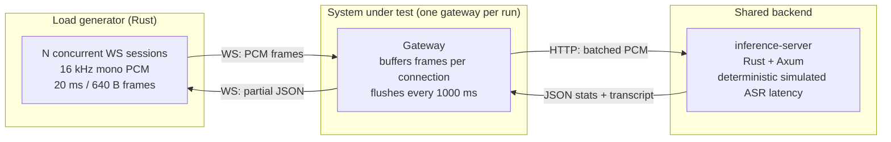

# websocket-stt-bench

## How many concurrent websocket audio-streaming sessions can modern async/actor runtimes sustain per vCPU?

This repo benchmarks streaming STT gateways behind one shared WebSocket protocol. Clients stream 16 kHz mono PCM at 20 ms / 640-byte frames; each gateway buffers per session, flushes every 1000 ms to a shared Rust inference simulator, and returns strict `partial` JSON messages.

Inspired by the [Benchmarks Game](https://benchmarksgame-team.pages.debian.net/benchmarksgame/index.html) and Karpathy's [autoresearch](https://github.com/karpathy/autoresearch).

## TL;DR


*Concurrent WebSocket sessions sustained inside the [SLO](#the-slo-what-passing-means):*

| Runtime | LOC | 1 vCPU | 2 vCPU | Bottleneck | Details |
|---|---:|---:|---:|---|---|
| **[Rust 1.95](https://github.com/rust-lang/rust) — two evented threads (`mio` epoll, **no async runtime**)** | 1221 | **4400**¶ | **5500** (1.25X) | newest-p50 latency | [runs](services/rust-sync/BENCHMARK.md) |
| **[C++23](https://en.cppreference.com/w/cpp/23) + [uWebSockets 20.77](https://github.com/uNetworking/uWebSockets)** | 1.6k | **4350**◆ | **TBD** | newest-p50 latency | [runs](services/cpp23-uwebsockets/BENCHMARK.md) |
| **[Rust 1.95](https://github.com/rust-lang/rust) + [Axum](https://github.com/tokio-rs/axum) / [Tokio](https://github.com/tokio-rs/tokio)** | 696 | **3475** | **4250** (1.22X) | CPU | [runs](services/rust-axum/BENCHMARK.md) |
| **[Java 25 LTS](https://openjdk.org/projects/jdk/25/) + [Helidon Níma 4.3](https://helidon.io/)** | 917 | 2600‡ | 3750 (1.44X) | latency, then heap/OOM cliff | [runs](services/java-helidon-nima/BENCHMARK.md) |
| **[TypeScript](https://www.typescriptlang.org/) on [Bun 1.3.13](https://bun.sh/)** | 734 | 2550‡ | n/a | memory/error cliff; fetch caveat | [runs](services/typescript-bun/BENCHMARK.md) |
| **[Go 1.26.3](https://go.dev/) + `net/http` / [`coder/websocket`](https://github.com/coder/websocket)** | 893 | 2500‡ | 4000 (1.60X) | CPU/latency | [runs](services/go-nethttp/BENCHMARK.md) |
| **[OxCaml 5.2.0+ox](https://oxcaml.org/) + Async** | 1235 | 2075 | ~2125§ | CPU, single Async domain | [runs](services/ocaml-oxcaml/BENCHMARK.md) |
| **[Scala 3.3 LTS](https://www.scala-lang.org/) + [Apache Pekko 1.6](https://pekko.apache.org/)** | 726 | 1400 | 2200 (1.57X) | connect timeouts | [runs](services/scala-pekko/BENCHMARK.md) |
| **[Elixir 1.19.5](https://github.com/elixir-lang/elixir) + [Phoenix](https://github.com/phoenixframework/phoenix) / [Bandit](https://github.com/mtrudel/bandit)** | 784 | 1250 | 2250 (1.80X) | CPU/memory | [runs](services/elixir-phoenix/BENCHMARK.md) |
| **[CPython 3.14.4](https://github.com/python/cpython) + uvloop + FastAPI / Granian** | 678 | 1100 | 1750 (1.59X)† | CPU | [runs](services/python-fastapi/BENCHMARK.md) |
| **[CPython 3.14.4t](https://github.com/python/cpython) free-threaded + uvloop + FastAPI / Granian** | 678 | 180 | 205 (1.14X) | send/close timeout reliability | [runs](services/python-fastapi/BENCHMARK.md) |

† Python scales out at 2 vCPU by adding worker processes; each Granian worker owns one asyncio loop.
‡ 1 vCPU / 2 GiB memory. The 1 GiB shape also OOMs near the edge, so the bumped 2 GiB shape is reported.
§ OxCaml runs one Async domain; a 2-vCPU pod does not use the second core meaningfully. Replica fan-out reached 3350 / 1.61X.
¶ **No async runtime, zero new dependencies, plain HTTP/1.1 — and it beats validated C++.** Two OS threads, each its own `mio`/epoll loop: a WebSocket loop + a dedicated inference loop, joined by `std::sync::mpsc` + a `mio::Waker` (the structural mirror of C++'s uWebSockets-loop + libcurl-`jthread`). 1 vCPU: **4400 confirmed (2/2) ↔ 4500 borderline ↔ 4600 first solid fail (2/2)**, clean newest-p50 edge, zero errors/restarts across 50→7000. 2 vCPU: **5500 confirmed ↔ 5600 first fail**, a real ~1.25× in-pod lift (the prior single-loop revision was replica-only — one loop is one core). The journey is the finding: thread-per-connection collapsed at ~825 (OS-thread CFS-throttle freeze); a single evented loop reached 3150; the assumed-final 3150→3475 gap to async Rust was blamed on HTTP/1.1-vs-HTTP/2 — wrong: it was **cooperative single-loop contention** (inference work interleaved with WebSocket flushes on one thread). One OS thread of separation — same transport, same pool, same `serde_json` — flipped a –9%-of-async-Rust deficit into a result above validated C++ (4350). The architecture, never the language or the transport, was the entire gap.
◆ Re-validated 2026-05-17 on the crash-fixed image: **4350 confirmed (2/2) ↔ 4400 first solid fail (2/2)**, a clean newest-p50 latency edge with zero errors and zero crashes through the whole 50→4450 sweep. The earlier 4450 was measured on a binary that SIGSEGVs under load (a `WsSink` use-after-free + a Bazel-9 build break — both fixed here); the fix trades ~2% steady-state capacity (`shared_ptr` + virtual dispatch on the hot send path) for correctness, so 4350 is the honest reproducible ceiling. See [runs](services/cpp23-uwebsockets/BENCHMARK.md).

The above numbers are the highest confirmed session counts that passed the SLO at the given vCPU shape. Detailed brackets, tables, and run notes live in the linked service benchmark docs.

**Hardware:** Intel Core i9-13900F, Ubuntu 24.04.3, k3s v1.35.4.

## Takeaways

- **A no-async-runtime Rust gateway is the per-vCPU leader — the architecture, never the language or the transport, was the gap.** Two OS threads (a `mio`/epoll WebSocket loop + a dedicated inference loop, `mpsc`+`Waker` between them; no async runtime, zero new deps, plain HTTP/1.1) sustain **4400 confirmed sessions/vCPU**, *above* validated C++ (4350) and +27% over async Rust/Axum (3475). The journey is the finding, in three evidence-driven stages: thread-per-connection collapsed at ~825 (OS-thread CFS-throttle freeze); a single evented loop reached 3150; the residual 3150→3475 was assumed to be HTTP/1.1-vs-HTTP/2 but was actually **cooperative single-loop contention** — moving inference to its own OS thread (same transport, same pool, same `serde_json`) lifted the confirmed ceiling to 4400 and past C++. 2 vCPU: 5500 (1.25× in-pod; the single-loop revision was replica-only).
- **C++ is no longer the capacity leader and is now Pareto-dominated:** uWebSockets + libcurl HTTP/2 holds 4350 (validated on the crash-fixed image), but two-thread sync Rust delivers more capacity at fewer LOC.
- **Async Rust is still the best balance:** 696 LOC and 3475 sessions/vCPU — the leanest of the high-capacity tier even though it no longer leads on raw capacity.
- **BEAM scales vertically better than it starts:** Elixir trails at 1 vCPU but has the cleanest 1→2 vCPU lift.
- **Bun is surprisingly competitive for a native WebSocket server path, but Bun `fetch` is not an h2c-parity transport.**
- **OxCaml got close to Java only after raw transport work:** persistent keep-alive + zero-copy framing moved the confirmed ceiling from 1050 to 2075.
- **Free-threaded Python with this FastAPI/Granian stack is reliability-limited today; treat it as a stack result, not a verdict on no-GIL Python.**

**Pareto frontier:** Python (678 LOC / 1100 sessions, leanest) · Rust/Axum (696 LOC / 3475, best balance) · Rust/sync two-thread (1221 LOC / 4400, most capacity). C++23 (1551 LOC / 4350) is now **strictly dominated** by the two-thread no-runtime Rust gateway — fewer LOC *and* more sessions — so it drops off the frontier.

## The SLO: what "passing" means

"Passing" means every gate below holds against loadgen HDR histograms, per audio frame:

| Gate | Threshold | What it bounds |
|---|---:|---|
| **Newest-frame p50** | **≤ 200 ms** | Responsiveness to freshest audio in a flushed batch |
| Newest-frame p95 | ≤ 350 ms | Tail on fresh audio |
| **Oldest-frame p50** | **≤ 1200 ms** | Worst per-frame wait after the 1000 ms flush interval |
| Oldest-frame p95 | ≤ 1650 ms | Tail on oldest buffered audio |
| **Errors** | **≤ 1 / 100k partials** | Protocol errors, inference failures, and timeouts |

The error budget tolerates kernel/TCP stall noise while staying far tighter than typical production STT targets.

## What this experiment measures

The gateways share the same black-box WebSocket contract:

- `GET /ws/stt` upgrades to WebSocket; `GET /health` returns 200.
- Client sends `{"type":"start"}` as text, then 640-byte binary PCM frames at 50 fps.
- Gateway flushes every 1000 ms to a shared Rust inference simulator.
- Gateway holds at most one in-flight inference request per connection.
- Gateway returns strict `partial` JSON with `oldest_frame_seq`, `newest_frame_seq`, `flush_lateness_ms`, and `inflight_model_jobs`.
- Invalid first message closes with `1002`; invalid binary frame size closes with `1003`.

The shared inference server is deterministic and simulates GPU-style latency with log-normal jitter, batch wait, and long-tail spikes. It is not a real ASR model. Real ASR weights, authentication, multi-tenancy, segmentation, retry/reconnect logic, and VAD are intentionally out of scope.

## Architecture



## Code Shape

| Runtime | Raw production LOC | Files | Implementation shape |
|---|---:|---:|---|
| Python | 678 | 9 | Pydantic boundaries, uvloop/FastAPI, dual GIL/free-threaded runtime path |
| Rust/Axum | 696 | 6 | Tokio tasks, `Arc<Semaphore>::new(1)`, zero-copy `BytesMut` batching |
| TypeScript/Bun | 734 | 6 | `Bun.serve`, Valibot boundaries, bounded outbox |
| Elixir | 784 | 13 | Phoenix/Bandit raw `WebSock`, process-per-connection |
| Go | 893 | 6 | `net/http`, `coder/websocket`, h2c inference client |
| Java | 917 | 16 | Helidon Níma virtual threads, sealed outbound messages |
| Rust/sync | 1221 | 6 | two `mio` epoll loops on two OS threads (no async runtime), `mpsc`+`Waker` handoff, bounded shared inference pool |
| OxCaml | 1235 | 21 | raw `Async.Tcp`, hand-rolled RFC 6455, opaque inflight capability |
| C++23 | 1551 | 11 | uWebSockets loop-per-thread, libcurl HTTP/2, Glaze JSON |

The load-bearing invariant is one in-flight inference request per connection. Every implementation enforces it, but the expression differs: semaphore, atomic flag, token channel, process state, task guard, `Mvar`-backed capability, or in the evented no-runtime Rust gateway, the single inference pool slot a connection holds while its request is in flight.

## Which runtime?

| If you optimize for | Pick | Why |
|---|---|---|
| Lowest dollars per session | Rust/sync (two-thread) | 4400 sessions/vCPU, memory-safe, no async runtime — beats C++ |
| Leanest of the high-capacity tier | Rust/Axum | 3475 sessions/vCPU in 696 LOC |
| Maximum capacity in C++ | C++23/uWebSockets | 4350 sessions/vCPU (validated, crash-fixed) |
| Rust-adjacent JVM capacity | Java/Helidon Níma | 2600 sessions/vCPU; watch heap at the cliff |
| JS ecosystem with strong capacity | TypeScript on Bun | 2550 sessions/vCPU on native Bun primitives |
| Go operational simplicity | Go/net-http | 2500 sessions/vCPU and explicit h2c transport |
| Vertical multi-core scale-up | Elixir | 1.80X lift 1→2 vCPU |
| Top capacity without an async runtime | Rust/sync | 4400 sessions/vCPU from two epoll loops on two OS threads; above C++ |
| Modeling invariants as types | OCaml/OxCaml | opaque inflight capability, still runtime-enforced |
| Free-threaded Python | wait | this stack is reliability-limited |

## Reproducing

```sh
just doctor          # verify pinned tool versions
just check           # full per-language gate
just compose-build   # build all images
just conformance     # protocol contract check
just bench-ladder rust-axum-single ws://127.0.0.1:3000/ws/stt
```

Local Compose runs the `single` or `multi` profile one at a time because profiles share host ports. Multi-vCPU capacity claims should be verified in-cluster; Compose under-reports once the gateway outpaces the in-VM inference simulator.

For reproducible Kubernetes runs, use `charts/stt-bench/` and `charts/stt-bench/README.md`. The chart renders the inference server, gateway Deployments, suspended loadgen/inferbench Jobs, and results PVC. Analysis uses paired `*.summary.json` / `*.samples.csv` artifacts:

```sh
just analyze-results <input-dir> <output-dir>
```

## Environment

- **Load generator:** `loadgen/rust/`, `tokio-tungstenite`, HDR histograms, strict `partial` validation.
- **k3s node:** Intel Core i9-13900F, 32 logical CPUs, 64 GiB RAM, Ubuntu 24.04.3, k3s v1.35.4.
- **Scheduling caveat:** Kubernetes CPU requests/limits are CFS quota, not CPU affinity; edge points can move with P/E-core migration on this hybrid CPU. Repeats and raw sample CSVs are the evidence.
- **Pinned versions:** `versions.lock.toml`.

## Known gaps

The current setup models compute saturation but not every backpressure path. Open: bounded per-connection input buffers with overflow policy, client-side send-wait time as a KPI, per-connection queue/drop metrics, a cross-connection job-queue limit, and overload conformance/stress checks.

**Inference-server placement:** local Compose under-reports fast gateway capacity once the gateway can outpace the in-VM simulator. Use the in-cluster path for capacity claims.

## Disclosure

This repo was created with assistance from ChatGPT 5.5 and Claude Opus 4.7.
